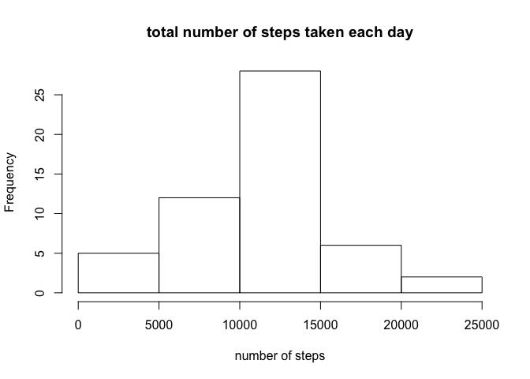

# Reproducible Research: Peer Assessment 1


## Loading and preprocessing the data

```r
library(data.table)
rawDT = read.csv("activity.csv")
rawTable = data.table(rawDT)
```

## What is mean total number of steps taken per day?

Calculate the total number of steps taken per day


```r
totStepsPerDay = rawTable[, list(tot=sum(steps)), by=date]
```

Plot histogram of the total number of steps taken each day


```r
hist(totStepsPerDay$tot[!is.na(totStepsPerDay$tot)], main="total number of steps taken each day", xlab="number of steps")
```

 

Calculate the mean and median of the total number of steps taken per day


```r
#mean
mean(totStepsPerDay$tot[!is.na(totStepsPerDay$tot)])
```

```
## [1] 10766.19
```

```r
#median
median(totStepsPerDay$tot[!is.na(totStepsPerDay$tot)])
```

```
## [1] 10765
```

## What is the average daily activity pattern?

Time series plot of the 5-minute interval (x-axis) and the average number of steps taken, averaged across all days (y-axis)


```r
totStepsPerInterval = rawTable[, list(tot=sum(steps, na.rm=T)), by=interval]
totStepsPerInterval$ave = totStepsPerInterval$tot / length(levels(rawDT$date))
plot(totStepsPerInterval$interval, totStepsPerInterval$ave, type="l", xlab="5-minute interval", ylab="average number of steps taken")
```

 

Identify which 5-minute interval, on average across all the days in the dataset, contains the maximum number of steps


```r
totStepsPerInterval[which.max(totStepsPerInterval$ave),]$interval
```

```
## [1] 835
```

## Imputing missing values

Calculate the total number of rows with NAs


```r
nrow(rawDT[!complete.cases(rawDT),])
```

```
## [1] 2304
```

Fill in all of the missing values in the dataset using the mean for that 5-minute interval and create a new dataset that is equal to the original dataset but with the missing data filled in.


```r
library(hash)
```

```
## hash-2.2.6 provided by Decision Patterns
## 
## 
## Attaching package: 'hash'
## 
## The following object is masked from 'package:data.table':
## 
##     copy
```

```r
interval2steps = hash(totStepsPerInterval$interval, totStepsPerInterval$ave)
newDT = rawDT
for (i in 1:nrow(newDT)) {
  if(is.na(newDT[i,1])){
    newDT[i,1] = interval2steps[[as.character(newDT[i,3])]]
  }
}
```

Make a histogram of the total number of steps taken each day and Calculate and report the mean and median total number of steps taken per day. Do these values differ from the estimates from the first part of the assignment? What is the impact of imputing missing data on the estimates of the total daily number of steps?

Plot histogram of the total number of steps taken each day and calculate the mean and median of the total number of steps taken per day


```r
newTable = data.table(newDT)
totStepsPerDay_new = newTable[, list(tot=sum(steps)), by=date]
hist(totStepsPerDay_new$tot, main="total number of steps taken each day", xlab="number of steps")
```

 

```r
#mean
mean(totStepsPerDay_new$tot)
```

```
## [1] 10581.01
```

```r
#median
median(totStepsPerDay_new$tot)
```

```
## [1] 10395
```

Imputing missing data increased the counts of total daily number of steps at lower range, which reduces the estimated mean  of the total daily number of steps.

## Are there differences in activity patterns between weekdays and weekends?


```r
numOfWeekend = length(which(weekdays(as.Date(levels(newTable$date))) %in% c("Saturday","Sunday")))
numOfWeekday = length(levels(newTable$date)) - numOfWeekend
newTable$weekday = weekdays(as.Date(newTable$date))
newTable$weekday = ifelse(newTable$weekday %in% c("Saturday", "Sunday"), "weekend", "weekday")
totStepsPerInterval_new = newTable[, list(tot=sum(steps, na.rm=T)), by=list(interval, weekday)]

totStepsPerInterval_new$ave = -1
totStepsPerInterval_new$ave = ifelse(totStepsPerInterval_new$weekday == "weekday", totStepsPerInterval_new$tot / numOfWeekday, totStepsPerInterval_new$tot / numOfWeekend)

library(lattice)
xyplot(ave ~ interval| weekday, 
           data = totStepsPerInterval_new,
           type = "l",
           xlab = "Interval",
           ylab = "Number of steps",
           layout=c(1,2))
```

 
